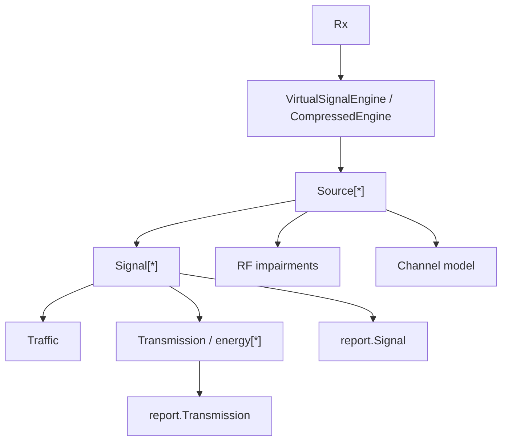
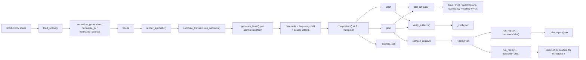
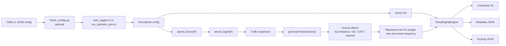
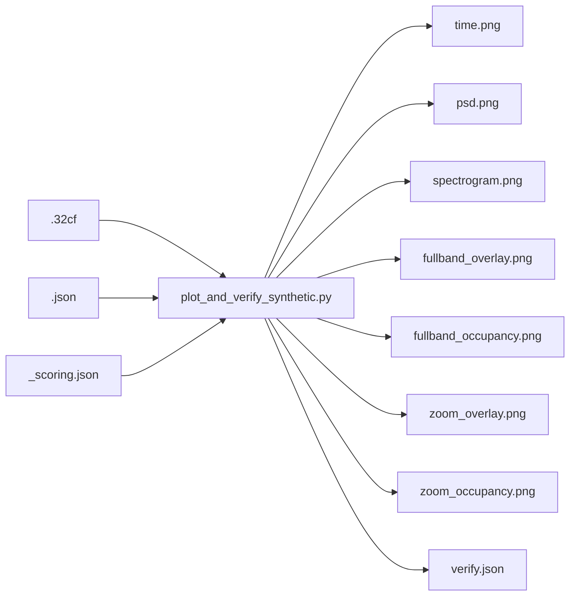
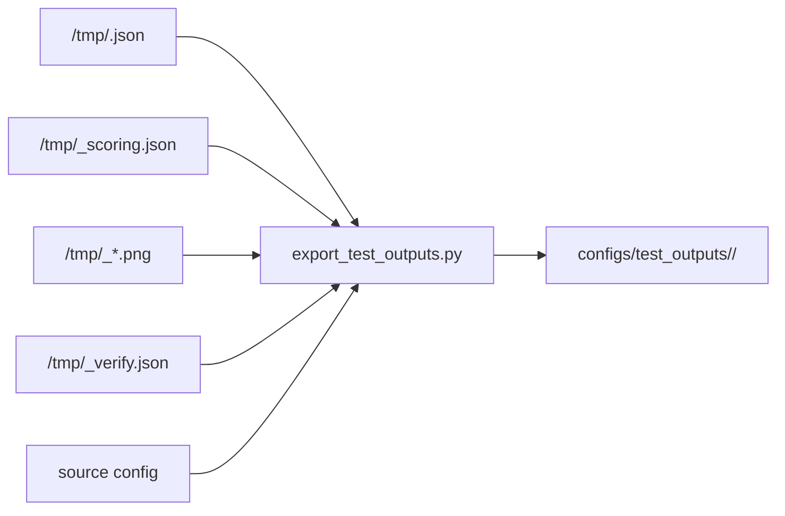
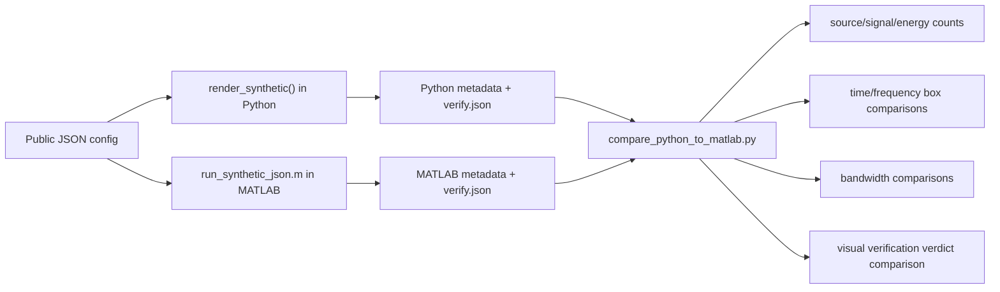
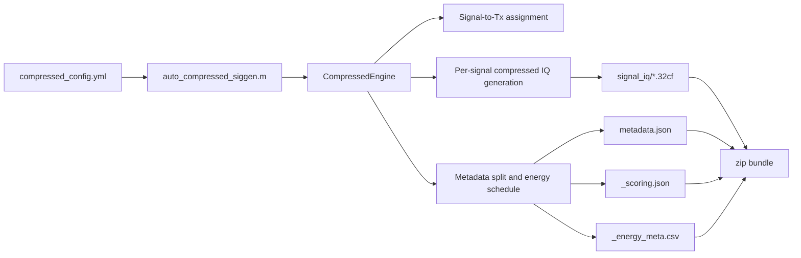
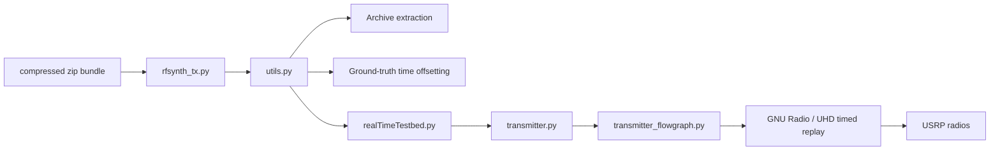

# Architecture

This document describes the current `rfsynth` flow end to end, including the new Python-native synthetic path, the legacy/reference MATLAB synthetic path, plotting and verification, compressed artifact generation, and OTA replay.

## 1. System split

`rfsynth` is now split into three practical subsystems:

- Python-native: short-JSON scene loading, synthetic rendering, metadata emission, plotting, visual verification, simulated replay, and the direct-UHD replay scaffold
- MATLAB: legacy/reference waveform semantics, traffic expansion, source/channel effects, metadata generation, synthetic IQ generation, compressed artifact generation
- Legacy Python OTA: config checking, test-output export, OTA bundle handling, metadata offsetting, and GNU Radio/UHD replay orchestration

The most important architectural boundary is:

- Python-native now supports a full synthetic path from JSON scene to IQ, metadata, plots, and simulated replay.
- MATLAB remains the behavior oracle during migration and still owns compressed generation.
- The older OTA Python code remains downstream of the MATLAB compressed path.

## 2. Canonical object model

The core MATLAB abstraction is `source -> signal -> energy`.

Meaning of each object:

- `Traffic`: when transmissions happen
- `Signal`: what one transmission waveform looks like
- `Source`: which signals belong to the same emitter and what source-level transforms are applied
- `Rx`: the synthetic observation point
- `Tx`: replay capacity in the compressed path only

`Tx` is not part of waveform semantics. It only appears when compressed generation needs to assign signals to replay resources.

## 3. Current config surfaces

There are four supported frontends:

| Flow | Config type | Entry point |
| --- | --- | --- |
| Python-native synthetic generation | JSON | `python -m rfsynth.cli generate` |
| Synthetic generation | YAML | `matlab/examples/auto_siggen.m` |
| Synthetic generation | JSON | `matlab/examples/run_synthetic_json.m` |
| Compressed generation | YAML | `matlab/examples/auto_compressed_siggen.m` |

Structural config validation is handled by:

- `scripts/check_configs.py`

Detailed field definitions are documented in:

- [CONFIG_FORMAT.md](./CONFIG_FORMAT.md)

## 4. Python-native synthetic generation flow

The new Python-native path is JSON-first and is the target architecture for the rebuild.

### 4.1 Python-native package layout

The new code lives under `rfsynth/native/`:

- `models.py`: `TrafficSpec`, `SignalSpec`, `SourceSpec`, `RxSpec`, `Scene`, `ArtifactBundle`, `ReplayPlan`
- `scene.py`: short/verbose JSON normalization and validation
- `waveforms.py`: atomic burst generators and traffic expansion
- `render.py`: synthetic composite rendering and metadata/scoring emission
- `plotting.py`: plot generation and visual verification
- `replay.py`: replay-plan compilation plus simulated and UHD-shaped backends
- `cli.py`: thin CLI surface

### 4.2 Python-native public interface

The top-level Python package exports:

- `load_scene(path_or_dict) -> Scene`
- `render_synthetic(scene, out_dir) -> ArtifactBundle`
- `plot_artifacts(bundle_or_base) -> PlotBundle`
- `verify_artifacts(bundle_or_base) -> dict`
- `compile_replay(scene_or_bundle) -> ReplayPlan`
- `run_replay(plan, backend="sim"|"uhd") -> ReplayRunReport`

### 4.3 Python-native config normalization

The canonical user-facing config is the short JSON schema:

- `output`
- `rx`
- `signals`

The Python-native loader also accepts the current verbose JSON schema and normalizes both into the same internal `Scene` model. This keeps compatibility with the existing public configs while making the short JSON form the product-facing default.

### 4.4 Python-native waveform coverage

Milestone 1 includes Python-native implementations for the current public atomic inventory:

- `Am`
- `Bluetooth`
- `Cpfsk`
- `Ds3`
- `DummySignal`
- `Fm`
- `FreqHopping`
- `Fsk`
- `Gfsk`
- `Gmsk`
- `Msk`
- `Ofdm`
- `Pam`
- `Psk`
- `Qam`
- `RandomSymbol`
- `Sine`
- `Ssb`
- `WidebandThermalWgn`
- `WlanNonHT80211g`

The Python-native implementation aims for behavior-level parity with the MATLAB path, not sample-for-sample equality.

## 5. MATLAB synthetic generation flow

The synthetic path is the main path for generated IQ plus metadata.

### 5.1 Synthetic config normalization

The synthetic wrappers both normalize into the same internal ingredients:

- `generationParameters`
- `rxConfig`
- `signals` or `sources`

`run_synthetic_json.m` now supports a short human-authored JSON form:

- `output`
- `rx`
- `signals`

and converts it into the same normalized shape the engine expects.

Important convenience behavior:

- if top-level `signals` are provided, each signal gets its own default `Source`
- if `trafficType` is omitted in the short JSON form, it defaults to periodic traffic at `100` transmissions per second
- default source channel is identity and default impairments are zero

### 5.2 Object construction

After normalization:

1. `atomic.Rx` is constructed from `rxConfig`
2. one or more `atomic.Source` objects are constructed
3. each source constructs one or more concrete `atomic.Signal` subclasses
4. `VirtualSignalEngine` owns the final scene assembly

### 5.3 Signal generation internals

For each signal:

1. `Traffic` expands the scene timing into concrete transmissions
2. the atomic waveform class generates baseband samples for each transmission through `generateTransmission()`
3. `Source` applies source-level effects:
   - carrier frequency offset
   - IQ imbalance
   - DC offset
   - channel model
4. the generated samples are resampled and shifted into the configured `Rx` observation band
5. `VirtualSignalEngine` sums all source contributions into one composite IQ output

### 5.4 Synthetic outputs

The synthetic path writes:

- `<base>.32cf`
- `<base>.json`
- `<base>_scoring.json`

These are written through `VirtualSignalEngine.writeDataFiles(...)`.

## 6. Plotting and visual verification flow

The plotting/verification path is synthetic-only and now runs directly on Python-native artifacts or MATLAB-generated artifacts with the same file layout.

What the plotter does:

- loads the generated IQ
- computes time-domain, PSD, and spectrogram views
- overlays signal and energy metadata boxes on top of the spectrogram
- colors signal families distinctly in mixed scenes
- writes a verification summary describing whether energy appears where metadata says it should

This is how the repo currently validates the synthetic atomic configs and the sneaky-neighbor scenes.

## 7. Repo-local test-output export flow

The repo keeps generated IQ files in `/tmp`, but stores plots and metadata snapshots inside the repo for inspection.

Each exported bundle typically contains:

- `config.json`
- `metadata.json`
- `scoring.json`
- `verify.json`
- `time.png`
- `psd.png`
- `spectrogram.png`
- `occupancy.png`
- `fullband_overlay.png`
- `fullband_occupancy.png`
- `zoom_overlay.png`
- `zoom_occupancy.png`

No `.32cf` files are copied into the repo.

## 8. MATLAB oracle comparison flow

The migration strategy uses MATLAB as a behavior oracle rather than requiring sample-for-sample equality.

Current oracle acceptance is behavior-level:

- source count
- signal count
- energy count
- signal and energy time boxes
- signal and energy frequency boxes
- bandwidth
- visual verification verdict

## 9. Compressed generation flow

The compressed path is used when the goal is long-duration replay rather than a single fully synthesized IQ output.

Key distinction from the synthetic path:

- synthetic generation produces one final IQ output at the `Rx`
- compressed generation produces replay-oriented signal payloads and scheduling metadata

`Tx` objects matter here because the engine must decide which logical transmitter can replay which signal without overlap conflicts.

## 10. OTA replay flow

The Python OTA path consumes the compressed bundle and maps it to real radios.

This path assumes:

- the compressed MATLAB bundle is already correct
- the `_energy_meta.csv` schedule matches the payload IQ files
- the radio JSON config maps bundle artifacts to real UHD devices

## 11. Implemented waveform inventory

Current concrete atomics in `matlab/lib/+atomic/`:

- `Am`
- `Bluetooth`
- `Cpfsk`
- `Ds3`
- `DummySignal`
- `Fm`
- `FreqHopping`
- `Fsk`
- `Gfsk`
- `Gmsk`
- `Msk`
- `Ofdm`
- `Pam`
- `Psk`
- `Qam`
- `RandomSymbol`
- `Sine`
- `Ssb`
- `WidebandThermalWgn`
- `WlanNonHT80211g`

## 10. Current synthetic test strategy

The current repo-level synthetic checks are:

1. validate config structure with `check_configs.py`
2. generate IQ plus metadata in MATLAB
3. plot and visually verify the result with `plot_and_verify_synthetic.py`
4. export metadata and plots into `configs/test_outputs/`

The main config sets used for this are:

- `configs/synthetic_atomic/*.json`
- `configs/synthetic_examples/*.json`

The mixed-scene examples currently include:

- `ofdm_am_adjacent`
- `ofdm_fsk_adjacent`
- `wlan_tone_adjacent`
- `qam_channel_edge`

## 11. Extension points

If you want to extend the repository, the practical extension points are:

- new waveform class: `matlab/lib/+atomic/<NewSignal>.m`
- new timing model: `matlab/lib/+atomic/Traffic.m`
- new metadata field: `matlab/lib/metadata_utils/+report/*`
- synthetic scene behavior: `matlab/lib/VirtualSignalEngine.m`
- compressed artifact behavior: `matlab/lib/CompressedEngine.m`
- JSON config normalization: `matlab/examples/run_synthetic_json.m`
- plotting and verification behavior: `scripts/plot_and_verify_synthetic.py`
- repo-local output packaging: `scripts/export_test_outputs.py`
- OTA orchestration: `rfsynth/rfsynth_tx.py` and `rfsynth/otatestbed/*`

## 12. Short version

The full operational story is:

1. author a YAML or JSON config
2. validate it structurally
3. generate synthetic IQ plus metadata in MATLAB
4. inspect the IQ visually against metadata
5. export plots and metadata for repo-local review
6. optionally generate compressed artifacts instead
7. optionally replay those compressed artifacts over SDR

That is the current architecture in its actual code path, not just the paper-level abstraction.
