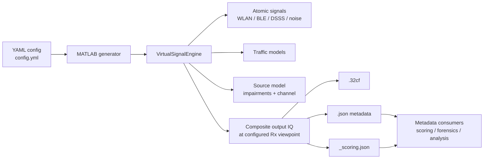
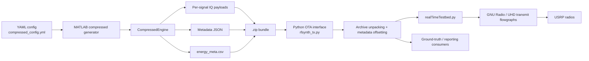
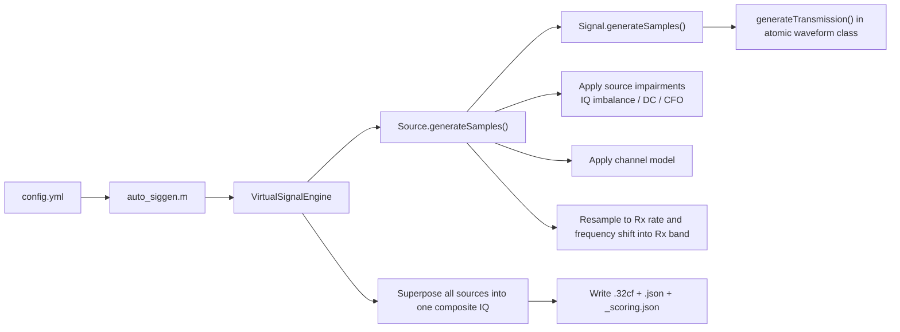
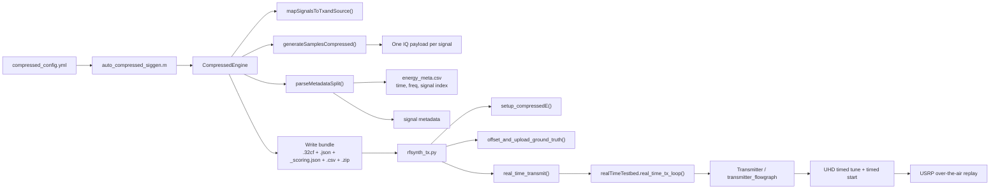

# `rfsynth`

`rfsynth` is an RF data generation and testing platform for spectrum information systems. The repository is organized around two major workflows:

1. MATLAB-based synthetic IQ and metadata generation.
2. Python/GNU Radio/UHD-based over-the-air replay of generated signals on Ettus USRPs.

The codebase implements the architecture described in the DySPAN 2024 paper, with a signal-generation core in `matlab/` and an SDR replay/testbed layer in `rfsynth/`.

<https://github.com/user-attachments/assets/295cc706-e7db-4178-b2d8-e8b314a08c92>

## Part 1: Using `rfsynth`

This section is for someone who wants to generate data, inspect metadata, or replay generated signals over the air.
For the MATLAB path, the output is synthesized IQ, not a hardware-captured receive recording. The generator creates signal content, applies source-level RF effects and channel transforms, and produces the final IQ seen at a configured Rx viewpoint.

### Choose a workflow

| Goal | Entry point | Main output |
| --- | --- | --- |
| Generate one synthetic IQ scene | `matlab/examples/auto_siggen.m` | One composite `.32cf` plus metadata |
| Generate artifacts for long-duration OTA replay | `matlab/examples/auto_compressed_siggen.m` | Per-signal `.32cf` files, metadata, schedule CSV, `.zip` bundle |
| Replay generated signals on USRPs | `rfsynth/rfsynth_tx.py` | OTA transmission plus time-shifted metadata |

### Mental model: how the main objects interact

The easiest way to understand the system is to separate waveform definition from scheduling and observation:

| Object | What it means | Main question it answers |
| --- | --- | --- |
| `Traffic` | When transmissions happen | "At what times do energies occur?" |
| `Signal` | What one transmission looks like | "What waveform/modulation/protocol is transmitted?" |
| `Source` | Which signals belong to one emitter, plus channel and RF effects | "Which signals come from the same device and what transforms are applied to them?" |
| `Rx` | Output observation viewpoint | "At what center frequency and sample rate is the final IQ produced?" |
| `Tx` | OTA replay resource used by the compressed path | "Which transmitter resources are available for replay?" |

In other words:

- `Traffic` decides the timing of energies.
- `Signal` generates the baseband samples for each energy.
- `Source` groups one or more signals and applies source-level RF impairments and channel transforms.
- `Rx` defines the final output IQ viewpoint.
- `Tx` is only for the compressed / OTA flow and represents replay capacity, not waveform semantics.

One important convenience behavior in the YAML-driven `auto_siggen` flow:

- The `signals:` list is the main user input.
- Each listed signal is automatically wrapped in a default `Source`.
- If you want multiple signals to explicitly share one `Source`, use the programmatic API in `matlab/examples/siggen_api.m`.

### Minimal input examples

There are three practical input surfaces in this repository:

1. Synthetic-generation YAML.
2. Compressed-generation YAML for OTA artifacts.
3. Python OTA transmitter JSON for actual USRP replay.

#### Example 1: minimal synthetic generation YAML

This is the simplest way to generate a synthetic IQ output.

```yaml
generationParameters:
  flagOutputIqSamples: true
  tot_time: 0.02
  outputFile: /tmp/testVirtualEngine

rxConfig:
  name: rx1
  rxSampleRate_Hz: 1.2288e8
  centerFreq_Hz: 2.45e9
  location: [0, 0, 0]

signals:
  - type: Bluetooth
    args:
      trafficType:
        type: periodic
        transmissionPerSec: 100
      centerFreq_Hz: 2.402e9
      txPower_db: -79
```

How to read this:

- `rxConfig` defines the output viewpoint.
- `signals[0].type` selects the atomic waveform class.
- `trafficType` determines when energies are placed.
- `centerFreq_Hz` and `txPower_db` define that signal's placement and power.
- `auto_siggen` will create one default `Source`, generate the BLE waveform, apply source/channel transforms, and write the final IQ and metadata.

#### Example 2: minimal compressed-generation YAML

This is the input for generating OTA replay artifacts.

```yaml
generationParameters:
  flagOutputIqSamples: true
  tot_time: 10
  outputFolder: /tmp
  filePrefix: test

rxConfig:
  name: rx1
  rxSampleRate_Hz: 1.2288e8
  centerFreq_Hz: 2.45e9
  location: [0, 0, 0]

txConfig:
  - name: tx1
    sampleRate_Hz: 1.2288e8
    location: [0, 0, 0]
    centerFreqRange_Hz: [100e6, 6e9]

signals:
  - type: WlanNonHT80211g
    args:
      trafficType:
        type: periodic
        transmissionPerSec: 100
      centerFreq_Hz: 2.412e9
      txPower_db: -74
```

How to read this:

- `signals:` still defines the waveform content and timing.
- `txConfig:` does not define the waveform. It defines the available logical transmit resources for assigning signals during compressed generation.
- `CompressedEngine` turns this into per-signal IQ files plus schedule metadata such as `_energy_meta.csv`.

#### Example 3: OTA transmitter JSON

This JSON config is used by the Python replay layer to bind replay artifacts to real SDR hardware.

```json
{
  "radios": [
    {
      "model": "USRP_X410",
      "name": "R2",
      "addrs": ["addr=192.168.2.19"],
      "sampleRate": 100000000,
      "masterClockRate": 200000000,
      "subdevSpec": "A:0",
      "channels": [
        {
          "name": "CH0",
          "antenna": "TX/RX",
          "gain": 0.8,
          "IQSTREAM_Params": {
            "frequency": 3500000000,
            "file": "/tmp/example_signal.32cf",
            "metadata": "/tmp/example_energy_meta.csv"
          }
        }
      ]
    }
  ]
}
```

How to read this:

- `radios[]` enumerates physical SDRs.
- `channels[]` configures each transmit channel on that SDR.
- `IQSTREAM_Params.file` points at the replay IQ payload.
- `IQSTREAM_Params.metadata` points at the energy schedule CSV used for timed replay.
- `frequency` is the RF center frequency used during OTA transmission.

### A concrete end-to-end story

For one periodic BLE example:

1. `Traffic(periodic, transmissionPerSec=100)` says there should be 100 energies per second.
2. `Bluetooth` says what one energy looks like in baseband.
3. `Source` applies IQ imbalance, DC offset, CFO, and channel effects.
4. `Rx` defines the output center frequency and sample rate for the final IQ written by MATLAB.
5. In the compressed flow, `Tx` resources are used to decide which replay resource carries the signal.
6. In the Python OTA flow, the JSON radio config tells GNU Radio/UHD which physical USRP transmits that IQ file and at what frequency.

### High-level system view: synthetic generation



### High-level system view: OTA transmission



### Quick start

#### 1. Synthetic composite IQ generation

Use this when the goal is to create one synthesized IQ output and metadata for a configured observation viewpoint:

```matlab
auto_siggen('config.yml');
```

This path creates:

- One composite `.32cf` file.
- One complete `.json` metadata file.
- One `_scoring.json` report.

For more MATLAB usage details, see [`matlab/README.md`](./matlab/README.md).

#### 2. Compressed artifact generation for OTA replay

Use this when the goal is to replay generated signals over SDRs for longer-duration experiments:

```matlab
auto_compressed_siggen('compressed_config.yml');
```

This path creates a compressed archive containing:

- Per-signal `.32cf` payload files.
- Metadata JSON.
- A scoring JSON report.
- An energy schedule CSV used by the Python OTA interface.

#### 3. OTA replay with USRPs

After generating the compressed bundle, invoke the Python replay path with a transmitter configuration JSON:

```bash
python rfsynth/rfsynth_tx.py --data /full/path/to/compressed_data.zip --txconfig ./configs/rt_tx_config_scenario_3.json
```

The example configuration files in `configs/` assume Ettus USRP radios and map one or more logical transmitters to UHD device addresses and channel parameters.

### User-facing artifact model

The repository uses a small set of recurring artifacts across both workflows:

- `.32cf`: complex float IQ samples.
- `.json`: full metadata for sources, signals, and energies.
- `_scoring.json`: reduced metadata for scoring or downstream evaluation.
- `_energy_meta.csv`: OTA replay schedule including energy timing, center frequency bounds, and IQ file assignment.
- `.zip`: archive used to move compressed generation outputs into the Python OTA layer.

### User-facing metadata model

The metadata hierarchy mirrors the signal hierarchy:

- `source`: transmitter entity, device origin, location, output sample rate, channel model.
- `signal`: protocol/modulation/modality/activity plus overall time-frequency bounds.
- `energy`: individual transmission instances with precise `time_start`, `time_stop`, `freq_lo`, and `freq_hi`.

This structure is implemented under `matlab/lib/metadata_utils/+report/`.

### Requirements

#### MATLAB generation

- MATLAB R2021b or later.
- Communications Toolbox.
- Bluetooth Toolbox.
- WLAN Toolbox.
- YAML support is vendored in `matlab/lib/utils/MartinKoch123-yaml-1.5.5.0/`.

Some channel and scheduling paths also rely on MATLAB functionality referenced in the codebase such as `winner2.*`, `comm.*`, and `fixed.Interval`.

#### Python / OTA replay

- Python 3.10 or later.
- PyYAML.
- pyzmq.
- numpy.
- pandas.
- scipy.
- matplotlib.
- absl-py.
- GNU Radio.
- UHD.
- Ettus USRP SDRs.

## Part 2: Extending `rfsynth`

This section is for someone who wants to add new waveforms, metadata fields, traffic models, or OTA control logic.

### Core abstraction model

The MATLAB engine follows the paper's three-level abstraction: `source -> signal -> energy`.


### Extension architecture: synthetic generation internals

This is the path to understand if you want to add new signal classes or modify how synthetic scenes are assembled.



### Extension architecture: OTA replay internals

This is the path to understand if you want to modify transmitter scheduling, artifact packaging, metadata propagation, or GNU Radio/UHD integration.



### Repository layout

| Path | Purpose |
| --- | --- |
| `matlab/examples/` | User-facing entrypoints such as `auto_siggen.m` and `auto_compressed_siggen.m`. |
| `matlab/lib/VirtualSignalEngine.m` | Main full-scene simulator that superposes all sources into one output IQ stream. |
| `matlab/lib/CompressedEngine.m` | Compressed generator for OTA replay artifacts and energy scheduling metadata. |
| `matlab/lib/+atomic/` | Atomic signal classes, traffic models, source model, RF impairments, Tx/Rx objects. |
| `matlab/lib/metadata_utils/+report/` | Metadata classes for source, signal, and transmission reporting. |
| `rfsynth/rfsynth_tx.py` | Top-level Python OTA replay entrypoint. |
| `rfsynth/utils.py` | Archive unpacking, ground-truth offsetting, and process orchestration helpers. |
| `rfsynth/otatestbed/realTimeTestbed.py` | Per-radio parallel transmission orchestration. |
| `rfsynth/otatestbed/transmitter*.py` | GNU Radio/UHD transmit-side flowgraph wrappers. |
| `rfsynth/otatestbed/receiver*.py` | GNU Radio/UHD receive-side flowgraph wrappers for OTA capture workflows. |
| `configs/` | Example USRP radio configuration files for OTA replay. |

### Main extension points

#### MATLAB generation layer

- `VirtualSignalEngine` is the base engine for full-scene synthetic generation.
- `CompressedEngine` is the OTA-oriented engine that emits per-signal IQ plus scheduling artifacts.
- `atomic.Source` models a transmitting entity and applies source-level impairments and channel transforms.
- `atomic.Signal` is the abstract waveform base class. Concrete implementations include:
  - `atomic.WlanNonHT80211g`
  - `atomic.Bluetooth`
  - `atomic.Ds3`
  - `atomic.WidebandThermalWgn`
- `atomic.Traffic` determines when energies occur.
- `report.*` classes define metadata serialized into JSON and scoring artifacts.

Typical extension tasks:

- Add a new waveform by creating a new class under `matlab/lib/+atomic/` that subclasses `atomic.Signal`.
- Add new scheduling behavior by extending `atomic.Traffic`.
- Add metadata fields by modifying the `report.*` classes and the JSON conversion paths.
- Change full-scene synthesis behavior in `VirtualSignalEngine` and `atomic.Source`.
- Change compressed artifact packaging in `CompressedEngine`.

#### Python OTA layer

- `rfsynth_tx.py` orchestrates compressed bundle replay.
- `utils.py` unpacks bundles, offsets metadata to wall-clock time, and launches replay workers.
- `realTimeTestbed.py` creates one worker per configured transmitter.
- `Transmitter` wraps a GNU Radio/UHD transmit graph and performs timed tuning and timed playback.
- `report_utils.py` rewrites metadata into OTA-aligned ground truth.
- `preamble.py`, `receiver.py`, and `otaTestbed.py` support receive-side OTA collection and slicing workflows.

Typical extension tasks:

- Change bundle unpacking or metadata adjustment logic in `utils.py`.
- Change per-radio orchestration in `realTimeTestbed.py`.
- Modify timed replay behavior in `Transmitter` and `transmitter_flowgraph.py`.
- Extend receive-side collection and slicing through `receiver.py`, `preamble.py`, and `otaTestbed.py`.

### Design intent

At a design level, the repository separates concerns cleanly:

- MATLAB handles signal semantics, traffic, metadata, impairments, and artifact generation.
- Python handles timed scheduling, metadata time-offsetting, and SDR playback.

That split is the main architectural idea to keep in mind while navigating the code.

## Citation

If you find this useful, please cite our work:

```
@inproceedings{RFSynth2024,
  author    = {Hari Prasad Sankar and Raghav Subbaraman and Tianyi Hu and Dinesh Bharadia},
  title     = {RFSynth: Data Generation and Testing Platform for Spectrum Information Systems},
  booktitle = {Proceedings of the 2024 IEEE International Symposium on Dynamic Spectrum Access Networks (DySpan)},
  year      = {2024},
  address   = {Washington, DC},
  month     = {May},
  publisher = {IEEE},
}
```

For the full paper and talk slides, please visit [wcsng.ucsd.edu/rfsynth](https://wcsng.ucsd.edu/rfsynth)

## Acknowledgements

This paper is based upon work supported in part by the Office of the Director of National Intelligence (ODNI), Intelligence Advanced Research Projects Activity (IARPA), via [2021-2106240007]. The views and conclusions contained herein are those of the authors and should not be interpreted as necessarily representing the official policies, either expressed or implied, of ODNI, IARPA, or the U.S. Government. The U.S. Government is authorized to reproduce and distribute reprints for governmental purposes notwithstanding any copyright annotation therein.
