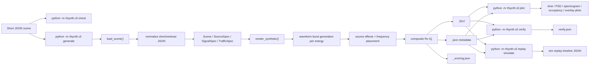
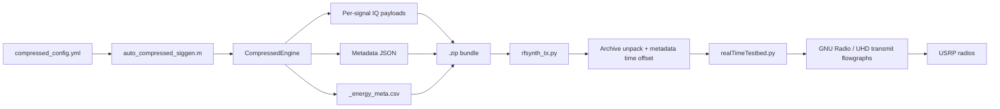
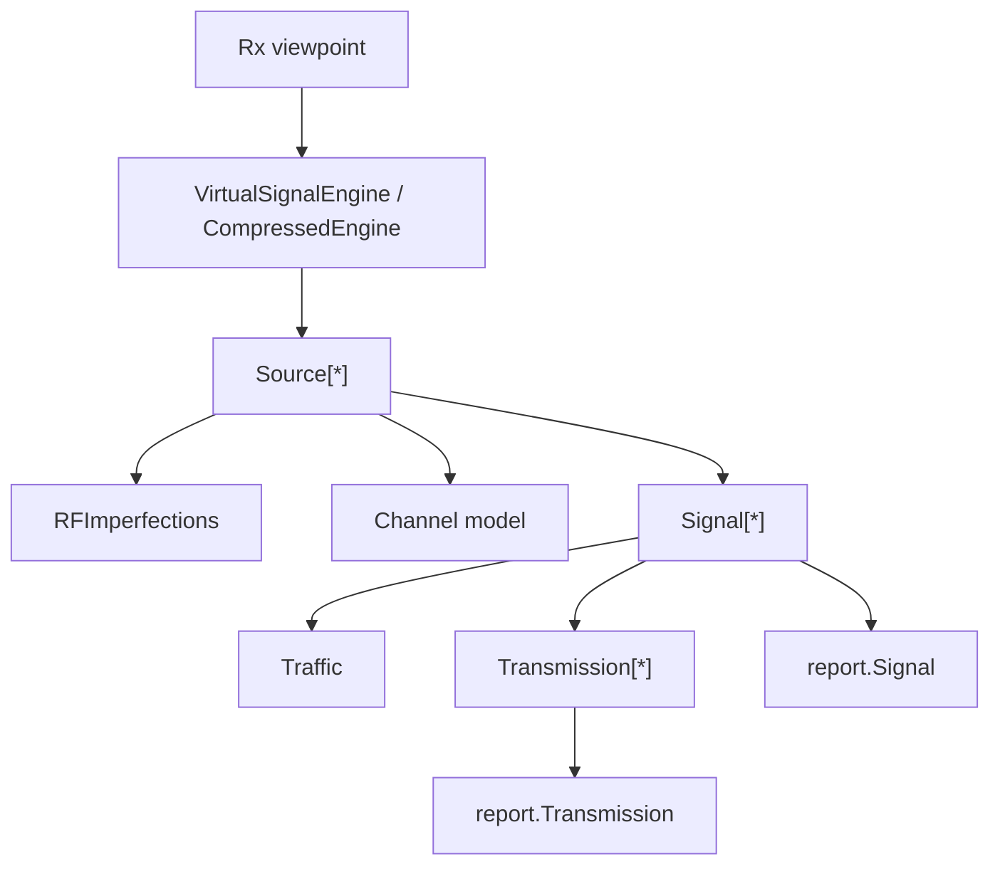

# `rfsynth`

`rfsynth` is an RF data generation and replay platform for spectrum information systems. The repository now has three practical execution paths:

- Python-native synthetic IQ, plotting, verification, and simulated replay from short JSON scenes
- MATLAB synthetic IQ and metadata generation from YAML or JSON
- MATLAB compressed artifact generation followed by OTA replay through Python, GNU Radio, and UHD

The fastest way to navigate the repo is:

- [README.md](./README.md): quick-start, user flows, and current entrypoints
- [ARCHITECTURE.md](./ARCHITECTURE.md): detailed end-to-end flow and component responsibilities
- [CONFIG_FORMAT.md](./CONFIG_FORMAT.md): YAML and JSON config shapes
- [matlab/README.md](./matlab/README.md): MATLAB-specific setup and entrypoints

<https://github.com/user-attachments/assets/295cc706-e7db-4178-b2d8-e8b314a08c92>

## Part 1: Using `rfsynth`

For both the Python-native and MATLAB synthetic paths, the output is synthesized IQ at a configured observation point. It is not a hardware receive capture. The generator creates signal content, expands traffic into transmissions, applies source/channel effects, and writes the final IQ and metadata seen at the configured `Rx`.

### Python-native milestone

The repo now includes a Python-native milestone-1 path under [rfsynth/native](/Users/dineshb/repos/signal-processing/rfsynth/rfsynth/native). This path is intentionally JSON-first and currently covers:

- scene loading and normalization from the short JSON schema
- synthetic IQ rendering to `.32cf`
- metadata and scoring JSON emission
- plotting and visual verification
- simulated replay planning and dry-run replay output
- a scaffolded direct-UHD replay backend for the next milestone

The existing MATLAB path remains the behavior oracle during migration.

### Choose a workflow

| Goal | Entry point | Main output |
| --- | --- | --- |
| Check config structure only | `scripts/check_configs.py` | pass/fail report |
| Generate one synthetic scene from Python | `python -m rfsynth.cli generate` | one composite `.32cf` plus metadata |
| Plot one synthetic scene from Python artifacts | `python -m rfsynth.cli plot` | plot bundle |
| Verify one synthetic scene from Python artifacts | `python -m rfsynth.cli verify` | `verify.json` |
| Compile and simulate replay from Python artifacts | `python -m rfsynth.cli replay simulate` | simulated replay timeline |
| Generate one synthetic scene from YAML | `matlab/examples/auto_siggen.m` | one composite `.32cf` plus metadata |
| Generate one synthetic scene from JSON | `matlab/examples/run_synthetic_json.m` | one composite `.32cf` plus metadata |
| Plot and visually verify a synthetic scene | `scripts/plot_and_verify_synthetic.py` | plots plus `verify.json` |
| Export synthetic test artifacts into the repo | `scripts/export_test_outputs.py` | `configs/test_outputs/*` |
| Generate compressed artifacts for OTA replay | `matlab/examples/auto_compressed_siggen.m` | per-signal IQ, metadata, schedule CSV, `.zip` |
| Replay a compressed bundle over SDR | `rfsynth/rfsynth_tx.py` | OTA transmission plus shifted metadata |

### Mental model

The object model is easiest to understand if waveform semantics are kept separate from replay resources:

| Object | Meaning | Main question |
| --- | --- | --- |
| `Traffic` | transmission timing | when do energies occur? |
| `Signal` | one waveform family | what does one transmission look like? |
| `Source` | emitter plus RF/channel effects | which signals come from the same device and what transforms are applied? |
| `Rx` | synthetic observation viewpoint | what center frequency and sample rate define the final IQ output? |
| `Tx` | replay capacity for the compressed path | which transmit resources are available for OTA replay? |

In practical terms:

- `Traffic` places energies in time.
- `Signal` generates one transmission waveform.
- `Source` owns one or more signals and applies impairments and channel effects.
- `Rx` defines the final synthetic output viewpoint.
- `Tx` only matters in the compressed / OTA path.

### Python-native synthetic flow

This is the new JSON-first synthetic path implemented in Python.



### MATLAB synthetic flow

This is the legacy/reference synthetic path used as the MATLAB oracle.

```mermaid
flowchart LR
    A["Config file<br/>YAML or JSON"] --> B["check_configs.py<br/>optional structural validation"]
    B --> C["auto_siggen.m or run_synthetic_json.m"]
    C --> D["Normalize config into<br/>generationParameters + rxConfig + signals/sources"]
    D --> E["Construct atomic.Rx"]
    D --> F["Construct atomic.Source[*]"]
    F --> G["Construct atomic.Signal[*]"]
    G --> H["Traffic expansion into energies"]
    H --> I["generateTransmission() in each atomic class"]
    I --> J["Source-level impairments + channel + resampling + frequency placement"]
    E --> K["VirtualSignalEngine"]
    J --> K
    K --> L["Composite IQ at Rx viewpoint"]
    L --> M[".32cf"]
    L --> N[".json metadata"]
    L --> O["_scoring.json"]
    M --> P["plot_and_verify_synthetic.py"]
    N --> P
    O --> P
    P --> Q["time / PSD / spectrogram / occupancy plots"]
    P --> R["verify.json"]
    Q --> S["export_test_outputs.py"]
    R --> S
    S --> T["configs/test_outputs/*"]
```



### Synthetic quick start

Run the JSON-first Python-native path:

```bash
cd /Users/dineshb/repos/signal-processing/rfsynth
PYTHONPATH=/Users/dineshb/repos/signal-processing/rfsynth \
/Users/dineshb/repos/signal-processing/rfsynth-python/.venv/bin/python \
  -m rfsynth.cli check configs/synthetic_examples/ofdm_am_adjacent_simple.json

PYTHONPATH=/Users/dineshb/repos/signal-processing/rfsynth \
/Users/dineshb/repos/signal-processing/rfsynth-python/.venv/bin/python \
  -m rfsynth.cli generate configs/synthetic_examples/ofdm_am_adjacent_simple.json --out /tmp/rfsynth_python_demo

PYTHONPATH=/Users/dineshb/repos/signal-processing/rfsynth \
/Users/dineshb/repos/signal-processing/rfsynth-python/.venv/bin/python \
  -m rfsynth.cli plot /tmp/rfsynth_python_demo/scene_ofdm_am_adjacent_simple

PYTHONPATH=/Users/dineshb/repos/signal-processing/rfsynth \
/Users/dineshb/repos/signal-processing/rfsynth-python/.venv/bin/python \
  -m rfsynth.cli verify /tmp/rfsynth_python_demo/scene_ofdm_am_adjacent_simple

PYTHONPATH=/Users/dineshb/repos/signal-processing/rfsynth \
/Users/dineshb/repos/signal-processing/rfsynth-python/.venv/bin/python \
  -m rfsynth.cli replay simulate /tmp/rfsynth_python_demo/scene_ofdm_am_adjacent_simple
```

Run the existing MATLAB path:

Validate configs first:

```bash
/Users/dineshb/repos/signal-processing/rfsynth-python/.venv/bin/python \
  /Users/dineshb/repos/signal-processing/rfsynth/scripts/check_configs.py
```

Run a YAML scene:

```matlab
auto_siggen('matlab/examples/config.yml');
```

Run a JSON scene:

```matlab
run_synthetic_json('configs/synthetic_examples/ofdm_am_adjacent_simple.json');
```

Plot and verify the generated scene:

```bash
MPLCONFIGDIR=/tmp/mpl-rfsynth \
/Users/dineshb/repos/signal-processing/rfsynth-python/.venv/bin/python \
  /Users/dineshb/repos/signal-processing/rfsynth/scripts/plot_and_verify_synthetic.py \
  --base /tmp/scene_ofdm_am_adjacent_simple
```

Export plots and metadata into the repo-local test output tree:

```bash
/Users/dineshb/repos/signal-processing/rfsynth-python/.venv/bin/python \
  /Users/dineshb/repos/signal-processing/rfsynth/scripts/export_test_outputs.py
```

### Current config surfaces

The repo currently supports four config frontends:

- short JSON synthetic scenes for the Python-native path
- synthetic YAML through `auto_siggen`
- synthetic JSON through `run_synthetic_json`
- compressed YAML through `auto_compressed_siggen`

The recommended human-authored format is the short synthetic JSON form documented in [CONFIG_FORMAT.md](./CONFIG_FORMAT.md). It is the canonical product-facing format for the Python-native path and is also accepted by the MATLAB JSON wrapper. Example:

- [configs/synthetic_examples/ofdm_am_adjacent_simple.json](./configs/synthetic_examples/ofdm_am_adjacent_simple.json)

The repo also includes:

- per-atomic synthetic configs in [configs/synthetic_atomic](./configs/synthetic_atomic)
- mixed-scene examples in [configs/synthetic_examples](./configs/synthetic_examples)
- exported plots and metadata in [configs/test_outputs](./configs/test_outputs)

### User-facing artifact model

The main recurring artifacts are:

- `.32cf`: complex float IQ samples
- `.json`: full metadata for sources, signals, and energies
- `_scoring.json`: reduced metadata for downstream scoring
- `_energy_meta.csv`: OTA replay schedule for compressed generation
- `.png`: time-domain, PSD, spectrogram, occupancy, and overlay plots
- `verify.json`: visual verification summary
- `.zip`: compressed archive for OTA replay

### Synthetic metadata model

The metadata hierarchy mirrors the signal hierarchy:

- `source`: emitter identity, origin, location, channel model, sample rate
- `signal`: protocol/modulation/activity plus aggregate time-frequency bounds
- `energy`: one concrete transmission instance with `time_start`, `time_stop`, `freq_lo`, and `freq_hi`

### OTA flow

The compressed/OTA path reuses the same signal semantics, but changes how artifacts are emitted and consumed.



Use the OTA path only after the synthetic/compressed side is working, because the Python layer assumes the MATLAB bundle and metadata are already correct.

### Requirements

MATLAB generation:

- MATLAB `R2021b` or later is the documented target
- Communications Toolbox
- Bluetooth Toolbox
- WLAN Toolbox
- vendored YAML support under `matlab/lib/utils/MartinKoch123-yaml-1.5.5.0/`

Python / OTA replay:

- Python 3.10+
- `PyYAML`, `numpy`, `pandas`, `scipy`, `matplotlib`, `pyzmq`, `absl-py`
- GNU Radio
- UHD
- Ettus USRP radios for real OTA replay

## Part 2: Extending `rfsynth`

The current architecture is split deliberately:

- Python-native `rfsynth/native` now owns short-JSON normalization, synthetic rendering, plotting, visual verification, and simulated replay.
- MATLAB still owns the legacy/reference waveform path and the compressed-generation path.
- The older Python OTA layer still owns the current GNU Radio/UHD replay path for compressed bundles.

### Core abstraction model

The MATLAB engine follows the paper's `source -> signal -> energy` abstraction:



### Main MATLAB components

| Path | Responsibility |
| --- | --- |
| `matlab/examples/auto_siggen.m` | YAML synthetic wrapper |
| `matlab/examples/run_synthetic_json.m` | JSON synthetic wrapper |
| `matlab/examples/auto_compressed_siggen.m` | YAML compressed wrapper |
| `matlab/lib/VirtualSignalEngine.m` | full-scene synthetic engine |
| `matlab/lib/CompressedEngine.m` | compressed artifact engine |
| `matlab/lib/+atomic/Signal.m` | waveform base class |
| `matlab/lib/+atomic/Source.m` | source-level effects and composition |
| `matlab/lib/+atomic/Traffic.m` | timing model |
| `matlab/lib/metadata_utils/+report/` | JSON/scoring metadata classes |

### Current atomic waveform inventory

Concrete atomics currently present in `matlab/lib/+atomic/` include:

- protocol / specialized: `Bluetooth`, `Ds3`, `WlanNonHT80211g`, `WidebandThermalWgn`
- digital modulation families: `Ofdm`, `Qam`, `Psk`, `Pam`, `Fsk`, `Cpfsk`, `Gfsk`, `Gmsk`, `Msk`
- analog / utility: `Am`, `Fm`, `Ssb`, `Sine`, `RandomSymbol`, `DummySignal`, `FreqHopping`

### Supporting scripts added around the MATLAB core

| Path | Responsibility |
| --- | --- |
| `scripts/check_configs.py` | structural validation for YAML and JSON configs |
| `scripts/plot_and_verify_synthetic.py` | plot generation and metadata-vs-energy visual checks |
| `scripts/run_atomic_synthetic_suite.py` | synthetic-only config sweep across the atomic configs |
| `scripts/export_test_outputs.py` | copies repo-safe plots and metadata into `configs/test_outputs/` |

### Key extension points

- add a new waveform by subclassing `atomic.Signal`
- add or change timing behavior in `atomic.Traffic`
- add metadata fields under `metadata_utils/+report`
- change synthetic composition in `VirtualSignalEngine` or `atomic.Source`
- change compressed artifact packaging in `CompressedEngine`
- change plot/verify behavior in `scripts/plot_and_verify_synthetic.py`
- change OTA replay behavior in `rfsynth/rfsynth_tx.py` and `rfsynth/otatestbed/*`

### More detail

For the full end-to-end data path, file movement, and component responsibilities, use [ARCHITECTURE.md](./ARCHITECTURE.md).

## Citation

If you find this useful, please cite our work:

```
@inproceedings{RFSynth2024,
  author    = {Hari Prasad Sankar and Raghav Subbaraman and Tianyi Hu and Dinesh Bharadia},
  title     = {RFSynth: Data Generation and Testing Platform for Spectrum Information Systems},
  booktitle = {Proceedings of the 2024 IEEE International Symposium on Dynamic Spectrum Access Networks (DySpan)},
  year      = {2024},
  address   = {Washington, DC},
  month     = {May},
  publisher = {IEEE},
}
```

For the full paper and talk slides, please visit [wcsng.ucsd.edu/rfsynth](https://wcsng.ucsd.edu/rfsynth)

## Acknowledgements

This paper is based upon work supported in part by the Office of the Director of National Intelligence (ODNI), Intelligence Advanced Research Projects Activity (IARPA), via [2021-2106240007]. The views and conclusions contained herein are those of the authors and should not be interpreted as necessarily representing the official policies, either expressed or implied, of ODNI, IARPA, or the U.S. Government. The U.S. Government is authorized to reproduce and distribute reprints for governmental purposes notwithstanding any copyright annotation therein.
