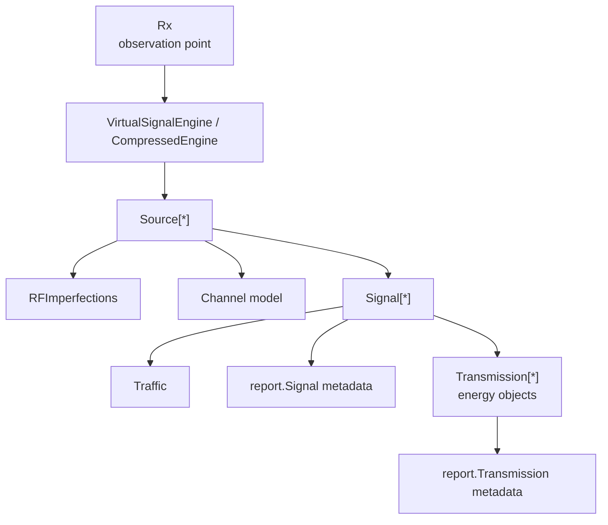
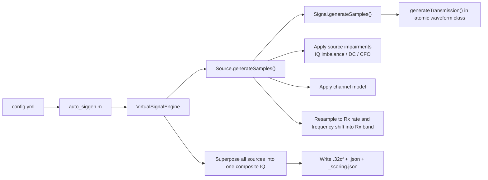
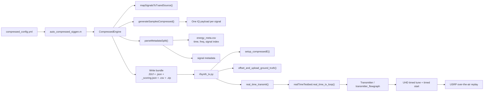

# `rfsynth`

`rfsynth` is an RF data generation and testing platform for spectrum information systems. The repository is organized around two major workflows:

1. MATLAB-based synthetic IQ and metadata generation.
2. Python/GNU Radio/UHD-based over-the-air replay of generated signals on Ettus USRPs.

The codebase implements the architecture described in the DySPAN 2024 paper, with a signal-generation core in `matlab/` and an SDR replay/testbed layer in `rfsynth/`.

<https://github.com/user-attachments/assets/295cc706-e7db-4178-b2d8-e8b314a08c92>

## Architecture

### High-level system view

```mermaid
flowchart LR
    A["User configuration<br/>YAML / JSON"] --> B["MATLAB generation layer"]
    B --> C["Generated artifacts"]
    C --> D["Python OTA interface"]
    D --> E["GNU Radio / UHD flowgraphs"]
    E --> F["USRP radios"]
    C --> G["Metadata consumers<br/>scoring / forensics / reporting"]
    D --> G

    subgraph B["MATLAB generation layer"]
        B1["VirtualSignalEngine<br/>full-scene IQ synthesis"]
        B2["CompressedEngine<br/>per-signal compressed generation"]
        B3["Atomic library<br/>WLAN / BLE / DSSS / noise"]
        B4["Traffic models<br/>periodic / poisson / customArray"]
        B5["Metadata model<br/>source / signal / energy"]
        B1 --> B3
        B1 --> B4
        B1 --> B5
        B2 --> B3
        B2 --> B4
        B2 --> B5
    end

    subgraph C["Generated artifacts"]
        C1[".32cf IQ files"]
        C2[".json metadata"]
        C3["_scoring.json"]
        C4["_energy_meta.csv"]
        C5["compressed .zip bundle"]
    end

    subgraph D["Python OTA interface"]
        D1["rfsynth_tx.py"]
        D2["utils.py"]
        D3["realTimeTestbed.py"]
        D4["report_utils.py"]
    end
```



### Core abstraction model

The MATLAB engine follows the paper's three-level abstraction: `source -> signal -> energy`.



### Full synthetic generation path

This path produces a single composite IQ capture at the receiver viewpoint.



### Compressed / OTA generation path

This path is used when long-duration OTA replay is needed. Instead of creating one large composite scene, the generator emits one IQ file per signal plus schedule metadata describing when and where each energy should be transmitted.



## Repository Layout

| Path | Purpose |
| --- | --- |
| `matlab/examples/` | User-facing entrypoints such as `auto_siggen.m` and `auto_compressed_siggen.m`. |
| `matlab/lib/VirtualSignalEngine.m` | Main full-scene simulator that superposes all sources into one IQ capture. |
| `matlab/lib/CompressedEngine.m` | Compressed generator for OTA replay artifacts and energy scheduling metadata. |
| `matlab/lib/+atomic/` | Atomic signal classes, traffic models, source model, RF impairments, Tx/Rx objects. |
| `matlab/lib/metadata_utils/+report/` | Metadata classes for source, signal, and transmission reporting. |
| `rfsynth/rfsynth_tx.py` | Top-level Python OTA replay entrypoint. |
| `rfsynth/utils.py` | Archive unpacking, ground-truth offsetting, and process orchestration helpers. |
| `rfsynth/otatestbed/realTimeTestbed.py` | Per-radio parallel transmission orchestration. |
| `rfsynth/otatestbed/transmitter*.py` | GNU Radio/UHD transmit-side flowgraph wrappers. |
| `rfsynth/otatestbed/receiver*.py` | GNU Radio/UHD receive-side flowgraph wrappers for OTA capture workflows. |
| `configs/` | Example USRP radio configuration files for OTA replay. |

## Main Components

### MATLAB generation layer

- `VirtualSignalEngine` is the base engine for full-scene synthetic generation.
- `CompressedEngine` is the OTA-oriented engine that emits per-signal IQ plus scheduling artifacts.
- `atomic.Source` models a transmitting entity and applies source-level impairments and channel transforms.
- `atomic.Signal` is the abstract waveform base class. Concrete implementations include:
  - `atomic.WlanNonHT80211g`
  - `atomic.Bluetooth`
  - `atomic.Ds3`
  - `atomic.WidebandThermalWgn`
- `atomic.Traffic` determines when energies occur.
- `report.*` classes define metadata serialized into JSON and scoring artifacts.

### Python OTA layer

- `rfsynth_tx.py` orchestrates compressed bundle replay.
- `utils.py` unpacks bundles, offsets metadata to wall-clock time, and launches replay workers.
- `realTimeTestbed.py` creates one worker per configured transmitter.
- `Transmitter` wraps a GNU Radio/UHD transmit graph and performs timed tuning and timed playback.
- `report_utils.py` rewrites metadata into OTA-aligned ground truth.
- `preamble.py`, `receiver.py`, and `otaTestbed.py` support receive-side OTA collection and slicing workflows.

## Execution Modes

### 1. Synthetic composite IQ generation

Use this when the goal is to create a single simulated receiver capture and metadata:

```matlab
auto_siggen('config.yml');
```

This path creates:

- One composite `.32cf` file.
- One complete `.json` metadata file.
- One `_scoring.json` report.

For more MATLAB usage details, see [`matlab/README.md`](./matlab/README.md).

### 2. Compressed artifact generation for OTA replay

Use this when the goal is to replay generated signals over SDRs for longer-duration experiments:

```matlab
auto_compressed_siggen('compressed_config.yml');
```

This path creates a compressed archive containing:

- Per-signal `.32cf` payload files.
- Metadata JSON.
- A scoring JSON report.
- An energy schedule CSV used by the Python OTA interface.

### 3. OTA replay with USRPs

After generating the compressed bundle, invoke the Python replay path with a transmitter configuration JSON:

```bash
python rfsynth/rfsynth_tx.py --data /full/path/to/compressed_data.zip --txconfig ./configs/rt_tx_config_scenario_3.json
```

The example configuration files in `configs/` assume Ettus USRP radios and map one or more logical transmitters to UHD device addresses and channel parameters.

## Artifact Model

The repository uses a small set of recurring artifacts across both workflows:

- `.32cf`: complex float IQ samples.
- `.json`: full metadata for sources, signals, and energies.
- `_scoring.json`: reduced metadata for scoring or downstream evaluation.
- `_energy_meta.csv`: OTA replay schedule including energy timing, center frequency bounds, and IQ file assignment.
- `.zip`: archive used to move compressed generation outputs into the Python OTA layer.

## Metadata Model

The metadata hierarchy mirrors the signal hierarchy:

- `source`: transmitter entity, device origin, location, output sample rate, channel model.
- `signal`: protocol/modulation/modality/activity plus overall time-frequency bounds.
- `energy`: individual transmission instances with precise `time_start`, `time_stop`, `freq_lo`, and `freq_hi`.

This structure is implemented under `matlab/lib/metadata_utils/+report/`.

## Requirements

### MATLAB generation

- MATLAB R2021b or later.
- Communications Toolbox.
- Bluetooth Toolbox.
- WLAN Toolbox.
- YAML support is vendored in `matlab/lib/utils/MartinKoch123-yaml-1.5.5.0/`.

Some channel and scheduling paths also rely on MATLAB functionality referenced in the codebase such as `winner2.*`, `comm.*`, and `fixed.Interval`.

### Python / OTA replay

- Python 3.10 or later.
- PyYAML.
- pyzmq.
- numpy.
- pandas.
- scipy.
- matplotlib.
- absl-py.
- GNU Radio.
- UHD.
- Ettus USRP SDRs.

## Notes on Design Intent

At a design level, the repository separates concerns cleanly:

- MATLAB handles signal semantics, traffic, metadata, impairments, and artifact generation.
- Python handles timed scheduling, metadata time-offsetting, and SDR playback.

That split is the main architectural idea to keep in mind while navigating the code.

## Citation

If you find this useful, please cite our work:

```
@inproceedings{RFSynth2024,
  author    = {Hari Prasad Sankar and Raghav Subbaraman and Tianyi Hu and Dinesh Bharadia},
  title     = {RFSynth: Data Generation and Testing Platform for Spectrum Information Systems},
  booktitle = {Proceedings of the 2024 IEEE International Symposium on Dynamic Spectrum Access Networks (DySpan)},
  year      = {2024},
  address   = {Washington, DC},
  month     = {May},
  publisher = {IEEE},
}
```

For the full paper and talk slides, please visit [wcsng.ucsd.edu/rfsynth](https://wcsng.ucsd.edu/rfsynth)

## Acknowledgements

This paper is based upon work supported in part by the Office of the Director of National Intelligence (ODNI), Intelligence Advanced Research Projects Activity (IARPA), via [2021-2106240007]. The views and conclusions contained herein are those of the authors and should not be interpreted as necessarily representing the official policies, either expressed or implied, of ODNI, IARPA, or the U.S. Government. The U.S. Government is authorized to reproduce and distribute reprints for governmental purposes notwithstanding any copyright annotation therein.
